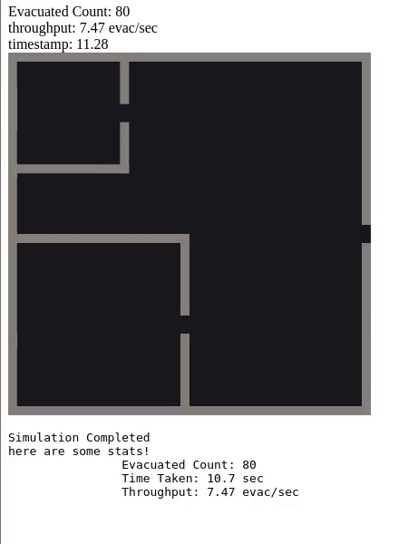
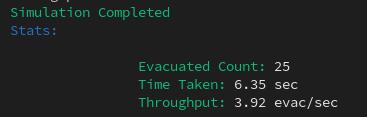

# CX4230 Evacuation Sim
*a simulation project for Gatech CX4230*  
[](https://circleci.com/gh/Bkucera/CX4230-evac-sim)

---> [Live Demo](https://kuc.io/CX4230-evac-sim/master) <---
---




## How to run:

### Install dependencies:

```bash
npm install
```

### Configure Parameters:

edit `params.json` with simulation parameters.


### Pick a simulation method

#### 1. In a browser (preferred)

```bash
npm run browser
```
Now open up a browser to **http://localhost:9000** to run the sim!  
To rerun it, just reload the page.

#### 2. In a terminal (boring)
```bash
npm run term
```
and the sim will run!

example)



...  
...
## Running instructions for deeplearning cluster:
**Important Note:** The project will be visible as a web server on `localhost:9000` **of the node you are ssh-ing into**. You can use ssh to map this to your own computer's `localhost:9000` through ssh using `ssh -L 9000:localhost:9000`

clone this repo using git or download:
```
git clone https://github.com/Bkucera/CX4230-evac-sim.git && cd CX4230-evac-sim
```

install [nodejs version manager](https://github.com/creationix/nvm):
```
curl -o- https://raw.githubusercontent.com/creationix/nvm/v0.33.8/install.sh | bash
```

then reload your bashrc:
```
. ~/.bashrc
```

then activate the LTS version of nodejs:
```
nvm install --lts
```
```
nvm alias default node
```

Now refer to **How to Run** above ⬆


...  
...
## Other info:

### Deployment:

All deployments are automated though Circle-CI (scripted in `scripts/deploy-ci.ts`).

Any commit to any branch will trigger a build and deployment to `kuc.io/CX4230-evac-sim/` + `branch_name`  
It follows that `master` will be viewable here: [kuc.io/CX4230-evac-sim/master](https://kuc.io/CX4230-evac-sim/issue-6/)


